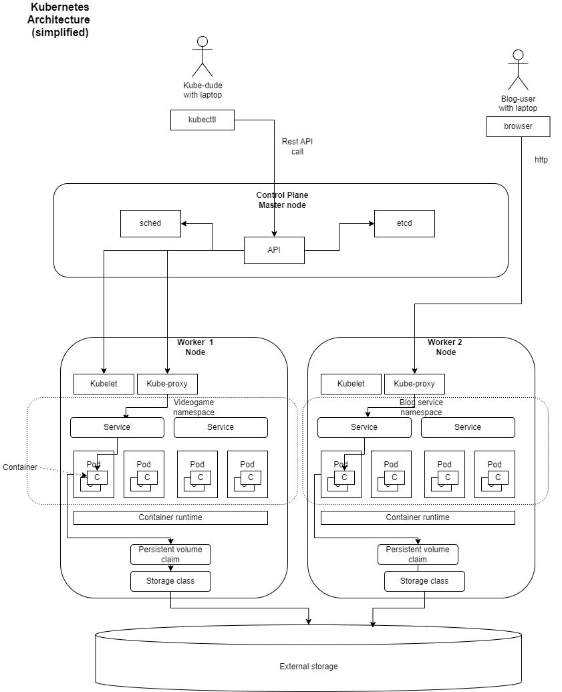

# Kubernetes

(Slightly) Simplified kubernetes architecture.

- Two different applications are split with namespaces, which include multiple pods and two services each.
- Three virtual machines; one for master node, and two for worker nodes. I think technically master node could be used to run pods as well.
- [Devopscube](https://devopscube.com/kubernetes-architecture-explained/) -article explained the inner workings of Kubernetes pretty well, especially how the scedhuler works. I don't think the requirement was to show how that or etcd works, so not complicating the diagram with those.

